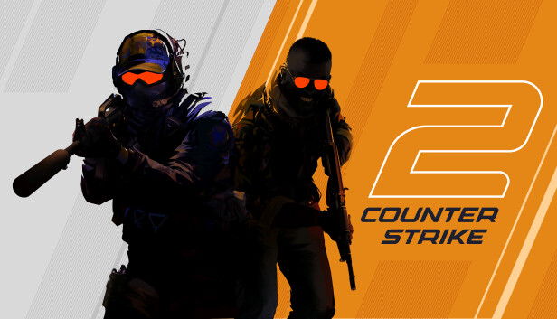

# Counter-Strike 2

## Introduction

Counter-Strike 2 (CS2) is the latest evolution of Valve’s legendary tactical first-person shooter series. Built using the powerful Source 2 engine, CS2 introduces upgraded visuals, improved physics, redesigned maps, and brand-new mechanics that redefine competitive gameplay while staying true to the classic CS formula.

The game continues the tradition of intense 5v5 tactical matches where teamwork, precision, and strategy determine victory. Every round offers players the chance to outsmart their opponents by using clever positioning, accurate shooting, and well-timed utility.

A major highlight of CS2 is its enhanced visual fidelity. Lighting, shadows, smoke effects, and textures have been fully reworked, giving maps a modern and highly polished look. This update allows both new and veteran players to enjoy a more immersive environment.

Valve has also improved the game’s responsiveness with sub-tick technology. This system ensures smoother and more accurate registration of movement and shooting, making every action feel more precise and consistent than in previous versions.

With regular updates, an active esports scene, and a passionate community, Counter-Strike 2 stands as one of the most influential and competitive shooters available today.

## Useful Links

- [Official Counter-Strike Website](https://www.counter-strike.net/)
- [Steam Download](https://store.steampowered.com/app/730/CounterStrike_2/)

| Feature       | Details |
|---------------|---------|
| Release Year  | 2023 |
| Genre         | Tactical FPS |
| Developer     | Valve |
| Game Engine   | Source 2 |
| Modes         | Competitive, Casual, Deathmatch, Wingman |